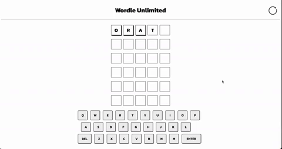

# wordle-clone

Purpose of this project is to build a wordle clone using HTML, CSS and JS.

# Image

# Link

https://paultree.github.io/wordle-clone/

# Setup

# MVP

- Create a 5 x 6 grid. - [x]
- Each grid cell should output a letter if user types on keyboard or clicks on application keyboard. - [x]
- Functional in-app keyboard. - [x]
- User should be able to submit word. - [x]

# Approach

Plan:

- Use an array of words in which we are going to pull a word to use as our answer. We are also going to the array word list to validate the user's response so that just like Wordle it will reject the user's input if they decide to put in 'spaghetti' words (eg. asdfg).
- Create a basic skeleton/framework of how a round of the game will work.
- Create a 5 x 6 grid (similar to Wordle) using HTML. User should only be able to fill out one row at a time. Only until user fulfills the following conditions can they move onto next row/attempt (unless they get the answer):
  - Must be a valid word (must be included in our word bank array)
  - Must be 5 letters
- For our grid, need to ID each row so that letters are input in the correct row.
- Each letter input by user will be pushed into an array

24/09/2022

- Built a basic navbar in which we will style it to look like the original game.
- Built a 5 x 6 grid that we used flexbox on. Added gap and margin to each individual box so that it looks like the original.
  - Named each row of the grid by row-1, row-2, row-3 so on and so forth. The intent in this will be explained later.
- Defined a function that randomly pulls a word from the array wordList.
  - Defined a variable arrSol that splits the random word into an array. We are going to use this to compare with our own word.
- Defined a variable row which can reference each row 1 by 1 depending on how many attempts the user has left in their game. Hence we defined another variable guessesRemaining to help with this.
- Added event listeners to Enter, Backspace and ONLY to alphabet keys[a-z].
  - Enter calls the checkGuess function.
    - Checks if the word/array submitted has 5 characters/elements.
    - Colors box to green if letter is matching and correct position, yellow is colored if letter is matching but position incorrect and grey for incorrect letter.
  - Backspace does 2 things:
    - removes the last element in our array arrWord (which is the guess we'll submit).
    - clears the text in the last child element of our current row with text inside of it.
  - Pressing an alphabet key pushes the key to arrWord arry and adds the key to the first child element of the current row without text.

Problems:

- If user's guess contains 2 same letters but answer only contains 1 of that letter, unable to figure out logic to overcome this. Ie. how to tell the program to yellow/green one of our letters but grey the other one. Instead, currently the program will target both letters from user input and turn them yellow/green.

Future:

- Build a keyboard that shades itself depending on the user's guesses.
- Fix the problem regarding identical letters being targeted even if there is only 1 of that letter in the answer.
- Build a rulebook.
- clean up the navbar.
- clean up the page.

26/09/2022

- Added another if statement to our 'yellow' coloring condition.
  - Did not fix our problem.
- Added an if statement to our checkGuess function that tells user they won if they guess correctly.
- Created a keyboard
- Updated some of the styling.

Problem:

- Same problem from 24/09/2022.

Future:

- If user guesses correctly, may add a feature where depending on how many guesses are remaining, the console or alert will tell the user something different. just like in the original.

27/09/2022

- Added functionality to keyboard
- Added feature where keyboard corresponds to submitted word.
- Addressed problem faced from 24/09/2022 entry.

To be implemented:

- A reset game button.
- Adding an alert to errors made by user.

28/09/2022

- Fixed an issue where keyboard wasn't maintaining the correct colours.
  - Used 3 for loops.
    - first loop turns all elements grey.
    - second loop turns all elements yellow. this is put 2nd to account for overlaps between these arrays.
    - 3rd loop turns all elements green.

To be implemented:

- Styling.

29/09/2022

- completed the styling.
- added in a reset button.
- added in a results screen upon win/lose.
  - added in a reset button to results screen. Alternatively, user can close out of the results screen.
- Re-arranged checkWord() so that it evaluates green letters first then checks for yellows/greys. Fixes an issue with the game where if answer only has 1 occurrence of a specific letter but submitted word has more than 1 occurrence and their positions is in a correct and incorrect position. If incorrect position occurs first, it turns yellow but then the correct position turns green.
- Added in code so that user is not able to submit same word more than once.
- Added in audio for when user wins/loses

1/10/2022

- minor fixes to bugs found.
  - addressed for scenario where answer has 1 letter occurrence less than user's word.
    - if user's letter is at exact position and at a position before the green position, it will turn it grey instead of yellow.

# Reflection

# Future Goals

- Add a score tracker that keeps count of how many times user has won versus how many times they have played.
- Add a tracker that that keeps count of how many times user had x amount of guesses left.
- Add animations that flip the tile upon user submitting answer.

# Further reading

# Stay in touch

# Licence

# Contribution
